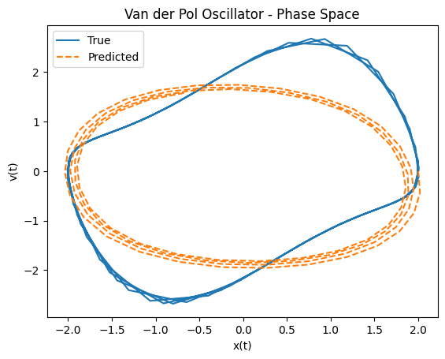

# NLD_Solve

This repository explores the application of neural ordinary differential equations (ODEs) to model and analyze nonlinear systems. By leveraging neural networks, the project aims to solve complex nonlinear dynamics, with a focus on period finding in 1-D maps.

### Project Progress

- [x] Initial implementation of Neural ODE for Van der Pol Oscillator.
- [ ] Understand and implement [NeuralODEs paper]([url](https://arxiv.org/pdf/1806.07366)) from scratch for general case.
- [ ] Exploration of period finding methods in 1-D maps using neural networks.
- [ ] Extension of neural ODEs to more complex nonlinear systems.
